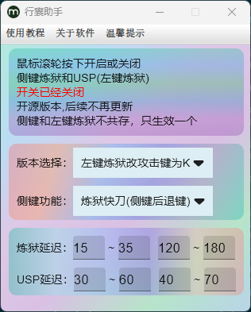
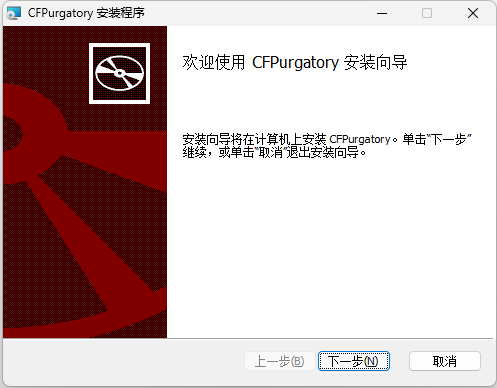
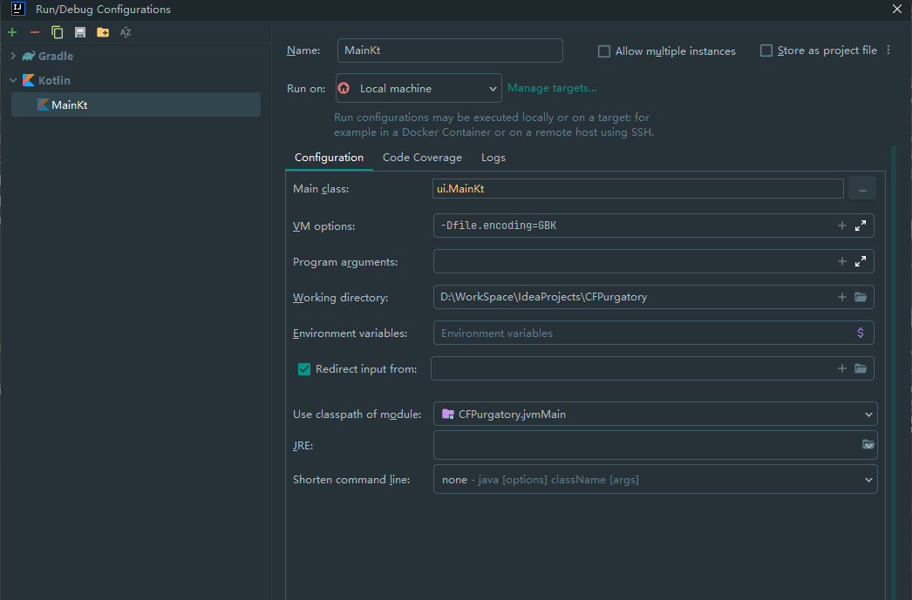

## 使用方法：

1. 下载或克隆项目代码
2. 使用IDEA打开项目
3. 运行项目-MainWindow
4. 点击鼠标滚轮按键会看到运行开关效果
5. 点击鼠标滚轮按键会看到运行开关效果
6. 进入游戏实战模式，可选侧键/左键

## 项目结构
+ 主程序Main.kt*

## 打包安装
1. 执行packageMsi命令将程序打包Msi压缩包
2. 生成的msi文件目录位于项目路径：build/compose/binaries/main/msi/CFPurgatory-${version}.msi
3. 安装完成打开主程序运行即可

   
## 项目乱码
* 确保运行的MainKt ---- Edit Configuration -VM Options中添加-Dfile.encoding=GBK，详细如下图所示

